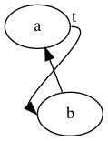

# GraphViz (.dot files)

Language reference: https://graphviz.org/doc/info/lang.html

List of attributes: https://graphviz.org/doc/info/attrs.html

Simple example:


You can easily render this by installing `graphviz` and running:

```bash
echo 'digraph test { a -> {b,c}; b -> c; b -> b; c -> b }'|dot -Tpng >out.png
```

Aliases for `kitty`:
```zsh
# in ~/.zshrc
kitty + complete setup zsh | source /dev/stdin
alias icat="kitty icat --align=left"
alias idot="dot -Tpng /dev/stdin -o /dev/stdout|icat"

# then execute
echo 'digraph test { a -> {b,c}; b -> c; b -> b; c -> b }'|icat
```

You can explicitly declare nodes like this:


Semicolons are optional.

`{a,b} -> {c,d}` connects every node in `{a,b}` with every node in `{c,d}`.

Identifiers (for nodes, graphs, etc.) can only contain letters, numbers and
underscores (and not begin with a number), or they must be escaped using `""` or `<>` (HTML escaping).


Using `graph` instead of `digraph`, and `--` instead of `->` creates an undirected graph:


Edge colors can be changed like this:


To change node colors, explicitly declare the node:


To create a horizontal graph, add `rankdir=LR` (case-sensitive):


You can specify directions using `:n` `:ne` `:e` `:se` `:s` `:sw` `:w` `:nw`:



